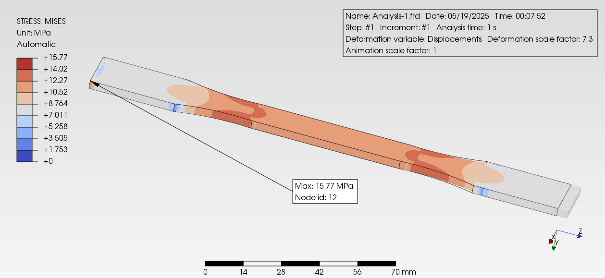
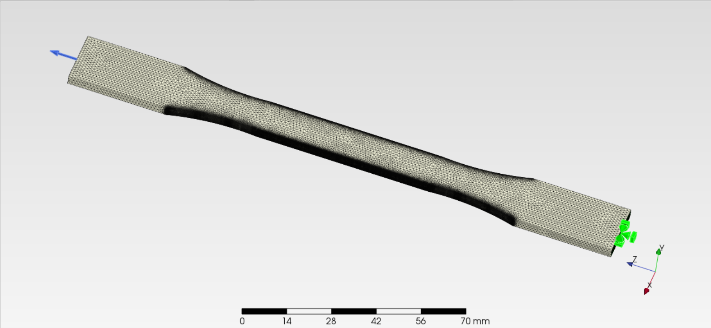
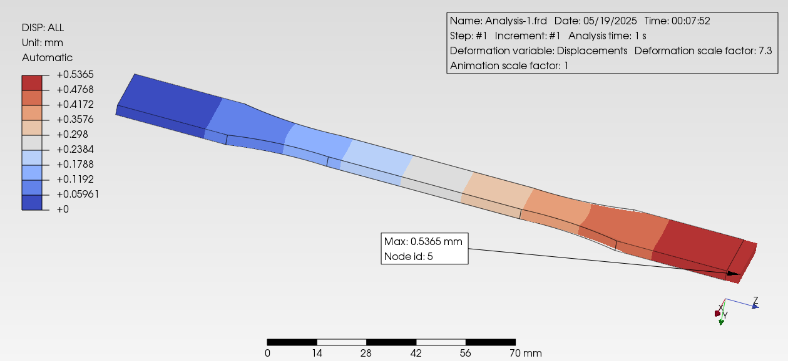

# PreProMax Simulation: ASTM D638 Benchmark

## Overview

This folder contains simulation files and workflow for running the ASTM D638 tensile specimen benchmark using PreProMax. The goal is to evaluate the accuracy and capabilities of PreProMax for static structural analysis, and to compare its results with other open-source FEM and simulation tools.

## Contents

- `Simulation  ASTM D638.pmx` – PreProMax project file for the ASTM D638 specimen
- `Analysis-1.frd` – Simulation results output
- Geometry, mesh, and material property files
- This README with instructions

## Dense mesh of astm d638

## Von Mises Stress Simulation Result

## Workflow

1. **Open Project:**  
   Launch PreProMax and open the `Simulation  ASTM D638.pmx` file.

2. **Review Geometry and Mesh:**  
   Inspect the imported ASTM D638 geometry and mesh settings.

3. **Assign Material Properties:**  
   Ensure material properties match ASTM D638 standard requirements.
   | Property        | Value (Example for PLA) |
| :-------------- | :---------------------- |
| Density         | 1250 kg/m³              |
| Young's Modulus | 3.5e9 Pa                |
| Poisson's Ratio | 0.36                    |

4. **Set Boundary Conditions:**  
   Apply appropriate loads and constraints as per the standard test method.
- Fixed
- Surface Tractions 500 N force

5. **Run Simulation:**  
   Execute the analysis and monitor for errors or warnings.

6. **Post-Processing:**  
   Review results in `Analysis-1.frd` or export data for comparison.
## Displacemnt

## Von Mises Stress Simulation Result

## Workflow
## How to Reproduce

- Install PreProMax (see [PreProMax documentation](https://prepromax.com/) for details)
- Open the provided project file
- Follow the workflow above
- Compare results with analytical solutions or other FEM software

## References

- ASTM D638 Standard Test Method for Tensile Properties of Plastics
- [PreProMax Documentation](https://prepromax.com/)
