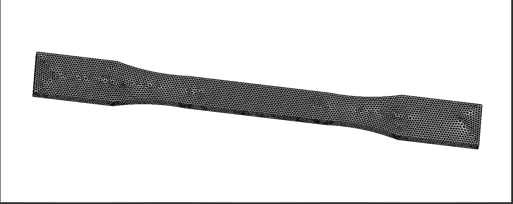
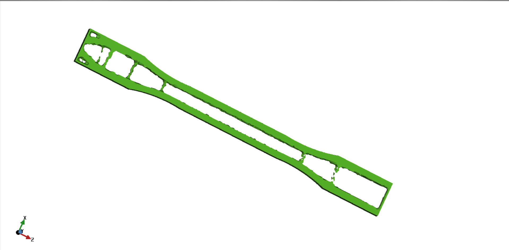

# Z88Arion Simulation: ASTM D638 Topology Optimization

## Overview

This folder contains simulation files, results, and workflow for running topology optimization on the ASTM D638 tensile specimen using the open-source software Z88Arion. The aim is to demonstrate the capabilities of Z88Arion for topology optimization and compare its results with other FEM and simulation tools.

## Contents

- Z88Arion project files for ASTM D638 topology optimization
- Input geometry and mesh files
- Simulation results and output files
- Screenshots of the workflow and results
- This README with instructions

## Workflow

1. **Open Project:**  
   Launch Z88Arion and open the provided project files for the ASTM D638 specimen.

2. **Review Geometry and Mesh:**  
   Inspect the imported geometry and mesh settings to ensure correctness.

3. **Assign Material Properties:**  
   Set material properties according to ASTM D638 standards or your specific requirements.

4. **Define Boundary Conditions and Loads:**  
   Apply constraints and loads as per the standard test method.

5. **Set Up Topology Optimization:**  
   Configure topology optimization parameters such as volume fraction, load cases, and optimization goals.

6. **Run Simulation:**  
   Execute the topology optimization and monitor the progress for errors or warnings.

7. **Post-Processing:**  
   Analyze the optimized structure and review the results using Z88Arion’s visualization tools.

## Screenshots

### Geometry and Mesh

### Optimization Result

## How to Reproduce

- Install Z88Arion (see [Z88Arion documentation](https://en.z88.de/z88arion/) for details)
- Open the provided project files
- Follow the workflow above
- Compare results with analytical solutions or other FEM software

## References

- ASTM D638 Standard Test Method for Tensile Properties of Plastics
- [Z88Arion Documentation](https://en.z88.de/z88arion/)

---